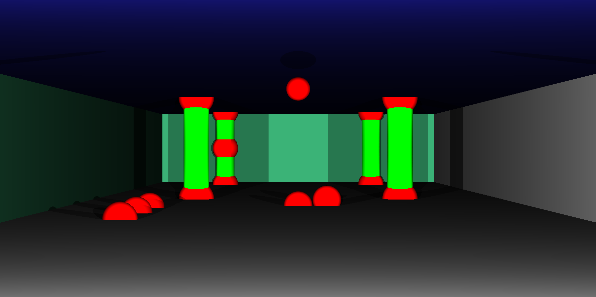

# RTv1
Ray Tracing

The goal of this project  is to generate images according to Raytracing protocol.
Those computer generated images will each represent a scene, as seen from a specific
angle and position, defined by simple geometric objects, and each with its own lighting
system.

